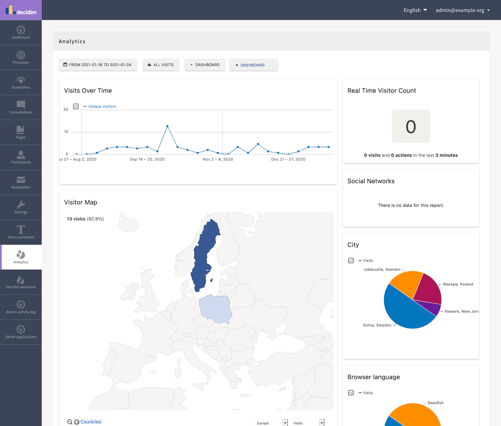

# Decidim::Analytics

A module adding an Analytics tab in the admin panel to embed a Matomo analytics dashboard.


## Usage

This module doesn't have any settings panel as I don't want to write anything in the database. It will pick the data it needs from Rails secrets:

```
matomo:
    enabled: true # The tab will only be visible if enabled = true
    server_address: https://matomo.example.org # The URL of your Matomo instance
    site_id: 1 # The Matomo site ID of the Decidim platform
    token_auth: 6a710da82ecb933866507c14bdb99351 # A Matomo authentication token.
```

Follow [these instructions](https://matomo.org/docs/embed-matomo-reports/#embed-piwik-widgets-on-a-password-protected-or-private-page) to get `token_auth` from Matomo.

The dashboard that will be shown on page load is using the default layout you set for all new dashboard. You can create several other dashboards for the user and you will be able to switch between them from Decidim.
## Installation

Add this line to your application's Gemfile:

```ruby
gem "decidim-analytics", git: "https://github.com/digidemlab/decidim-module-analytics"
```

And then execute:

```bash
bundle
```

Don't forget to set the above secrets in your `config/secrets.yml`. I recommend using environment variables so the secrets should look something like that:

```
matomo:
    enabled: <%= !ENV["MATOMO_SITE_ID"].blank? %>
    server_address: <%= ENV["MATOMO_SERVER_ADDRESS"] %>
    site_id: <%= ENV["MATOMO_SITE_ID"] %>
    token_auth: <%= ENV["MATOMO_TOKEN_AUTH"] %>
```

At Digidem Lab, we actually set the site ID dynamically when deploying through Ansible. Don't hesitate to [have a look](https://github.com/digidemlab/decidim-ansible/blob/master/roles/matomo/tasks/main.yml)!
## Contributing

Create an issue or a PR if you want to suggest an improvement. Keep in mind I'd like to keep this module lightweight and simple to maintain.

## License

This module is distributed under the GNU AFFERO GENERAL PUBLIC LICENSE.
